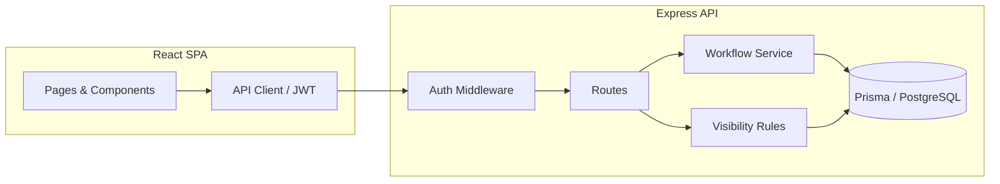
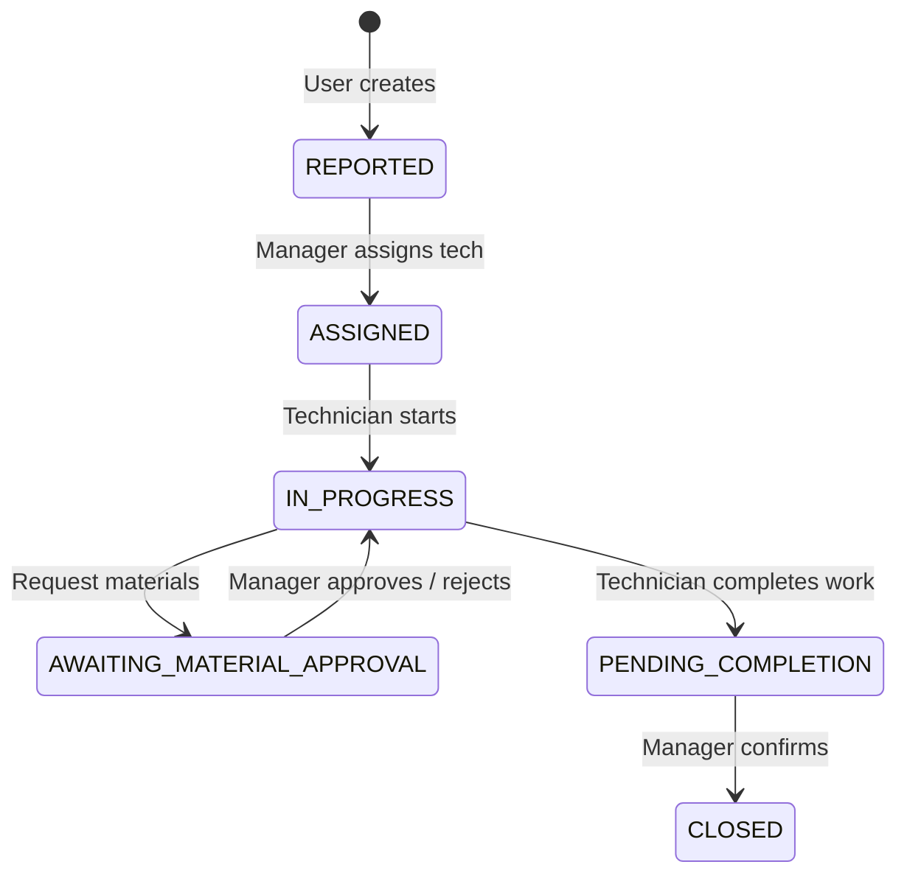

# Asset Maintenance — Factory Machinery

Full-stack application for reporting machinery issues, assigning work to technicians, material approvals, and completion confirmation by managers.

## Solution Overview

The system separates **domain logic** (task lifecycle and transitions) from **HTTP** and **persistence**. Tasks move through a finite set of states; only valid transitions are allowed for each role.

- **Users (reporters)** create maintenance tasks and track status for issues they reported.
- **Managers** see the full task list, assign technicians, approve or reject material requests, and confirm work after a technician marks completion.
- **Technicians** see only tasks assigned to them: start work, request materials (which pauses work until the manager approves), and submit completion for manager sign-off.

Task codes are **unique**, **auto-generated** strings in the form `TSK-<numeric>-<random>` (e.g. `TSK-1234-A3F`).

### Efficiency & Scalability

- **Indexed queries**: Database indexes on `taskCode`, `status`, `reporterId`, and `assigneeId` support fast filtering and search.
- **Stateless API**: JWT authentication allows horizontal scaling of API instances behind a load balancer; no server-side session store required.
- **Modular layers**: Routes → services (workflow + visibility) → Prisma data access. The default database is **PostgreSQL** (see `docker-compose.yml` for a local instance).
- **Pagination-ready**: List endpoints accept `limit`/`offset` (defaults provided) to avoid loading entire tables as data grows.

## Architecture Flow



**Data flow**

1. User logs in; server returns a JWT containing `userId` and `role`.
2. Authenticated requests hit route handlers that call **workflow** functions for state changes and **visibility** helpers to build Prisma `where` clauses (the “path” to data each role may see).
3. Task list/detail responses are filtered so reporters see only their tasks, technicians only assigned tasks, and managers all tasks.

## Domain Model (summary)

| Entity | Purpose |
|--------|---------|
| **User** | Email, password hash, role: `USER`, `MANAGER`, `TECHNICIAN` |
| **Task** | `taskCode`, title, description, machinery label, `status`, `reporterId`, `assigneeId` |
| **MaterialRequest** | Linked to a task; `PENDING` until manager **APPROVE** or **REJECT** |

### Task status workflow



## Data visibility (“XPath-style” constraints)

Visibility is enforced in one place (`server/src/services/taskVisibility.ts`) by composing Prisma `where` objects:

| Role | Rule |
|------|------|
| `USER` | `reporterId === currentUser.id` |
| `TECHNICIAN` | `assigneeId === currentUser.id` |
| `MANAGER` | No extra filter (all tasks) |

Combined with search/filter query parameters, every list endpoint applies the same base visibility filter.

## REST integration (bonus)

Protected by `X-API-Key` header (set `PUBLIC_API_KEY` in server `.env`):

- `GET /api/public/tasks/:taskCode` — fetch task details (and latest material request).
- `POST /api/public/tasks` — create a task (body: title, description, machineryLabel, optional reporterEmail for linking to an existing user).

Examples (after the API is running and the database is migrated):

```bash
export KEY=demo-public-api-key-change-in-production

curl -s -H "X-API-Key: $KEY" \
  http://localhost:4000/api/public/tasks/TSK-1000-ABC

curl -s -X POST -H "X-API-Key: $KEY" -H "Content-Type: application/json" \
  -d '{"title":"Belt slip","description":"Replace belt on conveyor 2","reporterEmail":"user@demo.com"}' \
  http://localhost:4000/api/public/tasks
```

## Prerequisites

- Node.js 18+
- npm 9+
- **PostgreSQL** (or [Docker](https://docs.docker.com/get-docker/) to run the bundled database — see below)

## Build & Run

### 1. Install dependencies (root + workspaces)

```bash
cd asset-maintenance
npm install
```

### 2. Database (PostgreSQL)

Start a fresh database. **Option A — Docker** (recommended for local dev):

```bash
# From repo root
docker compose up -d
```

This runs PostgreSQL 16 with user `asset`, password `asset`, database `asset_maintenance` on port `5432`.

**Option B — your own Postgres:** create an empty database and set `DATABASE_URL` in `.env` accordingly (see `server/.env.example`).

### 3. Server environment

```bash
cd server
cp .env.example .env
# Edit .env if needed (DATABASE_URL, JWT_SECRET, PUBLIC_API_KEY, PORT)
npx prisma migrate deploy
npx prisma db seed
```

> **Note:** Old SQLite files (`*.db`) are no longer used. You can delete any `dev.db` left over from earlier runs.

### 4. Run API and client (development)

From repository root:

```bash
npm run dev
```

- API: `http://localhost:4000`
- Client: `http://localhost:5173`

Or run separately:

```bash
# Terminal 1
cd server && npm run dev

# Terminal 2
cd client && npm run dev
```

### 5. Production build

```bash
npm run build
```

Compiles the API to `server/dist` (`node server/dist/index.js` after `prisma generate`); the client bundle is in `client/dist` (serve with any static host or `vite preview`).

**Stack:** TypeScript on both **server** (Express, `tsx` for dev, `tsc` for build) and **client** (React + Vite).

## Demo accounts (after seed)

| Email | Password | Role |
|-------|----------|------|
| `user@demo.com` | `password123` | User |
| `manager@demo.com` | `password123` | Manager |
| `tech@demo.com` | `password123` | Technician |

## Unit tests

Backend Jest tests cover:

- **`taskCode.test.ts`** — generated codes match the expected pattern.
- **`taskWorkflow.test.ts`** — allowed and disallowed transitions by role.
- **`taskVisibility.test.ts`** — base `where` clauses per role and merging search/status filters.

```bash
cd server
npm test
```

## Project layout

```
asset-maintenance/
├── README.md
├── docker-compose.yml   # Optional local PostgreSQL
├── package.json
├── server/              # Express + Prisma
│   ├── prisma/
│   ├── src/
│   └── package.json
└── client/              # React + Vite
    ├── src/
    └── package.json
```

## License

MIT — assessment / interview use.
